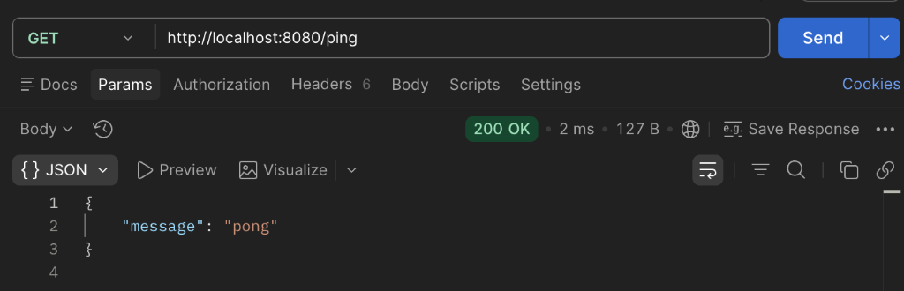
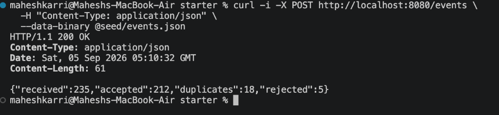

# ThinkWideWeb Test — Campaign Events

A high-performance Go backend service and debugging assessment. This project ingests marketing lifecycle events from third-party delivery providers, handles out-of-order and duplicate deliveries, isolates malformed records, and exposes campaign statistics for live dashboards.

---

## 1. Starter Service (Part 2)

The `starter/` directory contains the event ingestion and campaign analytics HTTP API.

### Getting Started
* **Prerequisites**: Go 1.22+ (standard library only, zero external dependencies).
* **Start Server**:
  ```bash
  cd starter
  go run .
  ```
  The server starts listening on `:8080`.

* **Run Tests**:
  ```bash
  cd starter
  go test -v -race .
  ```

---

### Endpoints, Implementation & Verified Outputs

#### 1.1 Server Health Check (`GET /ping`)
* **What was done**: Liveness probe returning HTTP 200 with JSON payload.
* **Request**:
  ```bash
  curl http://localhost:8080/ping
  ```
* **Output**:
  ```json
  {"message": "pong"}
  ```
* **Screenshot**:
  

---

#### 1.2 Event Ingestion (`POST /events`)
* **What was done**:
  - **Error Isolation**: Decodes incoming batches into `[]json.RawMessage` so malformed items (invalid timestamps, missing IDs) are rejected without failing the valid events.
  - **Deduplication**: Tracks unique `event_id`s in a concurrency-safe store (`sync.RWMutex`). Idempotent provider retries are discarded without double-counting.
  - **Normalization**: Normalizes event types to lowercase (e.g., `OPENED` to `opened`) and parses multi-format timestamps into UTC.
  - **Audit Response**: Returns exact counts of received, accepted, duplicate, and rejected records.
* **Request**:
  ```bash
  curl -i -X POST http://localhost:8080/events \
    -H "Content-Type: application/json" \
    --data-binary @seed/events.json
  ```
* **Output**:
  ```json
  {
    "received": 235,
    "accepted": 212,
    "duplicates": 18,
    "rejected": 5
  }
  ```
* **Screenshot**:
  

---

#### 1.3 Campaign Statistics (`GET /campaigns/{campaign_id}/stats`)
* **What was done**:
  - Structured into **messages** (delivery funnel) and **engagement** (reach).
  - Tracks both total interaction counts and distinct recipients reached (`unique_opens`, `unique_clicks`) by contact ID.
  - Returns `404 Not Found` if a campaign has no registered events.

##### Campaign: `cmp_summer_sale`
* **Request**:
  ```bash
  curl http://localhost:8080/campaigns/cmp_summer_sale/stats
  ```
* **Output**:
  ```json
  {
    "campaign_id": "cmp_summer_sale",
    "messages": {
      "sent": 40,
      "delivered": 36
    },
    "engagement": {
      "total_opens": 28,
      "unique_opens": 20,
      "total_clicks": 12,
      "unique_clicks": 12
    }
  }
  ```
* **Screenshot**:
  

##### Campaign: `cmp_welcome`
* **Request**:
  ```bash
  curl http://localhost:8080/campaigns/cmp_welcome/stats
  ```
* **Output**:
  ```json
  {
    "campaign_id": "cmp_welcome",
    "messages": {
      "sent": 20,
      "delivered": 19
    },
    "engagement": {
      "total_opens": 20,
      "unique_opens": 12,
      "total_clicks": 3,
      "unique_clicks": 3
    }
  }
  ```
* **Screenshot**:
  

##### Campaign: `cmp_winback`
* **Request**:
  ```bash
  curl http://localhost:8080/campaigns/cmp_winback/stats
  ```
* **Output**:
  ```json
  {
    "campaign_id": "cmp_winback",
    "messages": {
      "sent": 12,
      "delivered": 11
    },
    "engagement": {
      "total_opens": 7,
      "unique_opens": 6,
      "total_clicks": 4,
      "unique_clicks": 4
    }
  }
  ```
* **Screenshot**:
  

##### Non-Existent Campaign: `cmp_does_not_exist` (404)
* **Request**:
  ```bash
  curl -i http://localhost:8080/campaigns/cmp_does_not_exist/stats
  ```
* **Output**:
  ```http
  HTTP/1.1 404 Not Found
  Content-Type: application/json

  {"error":"campaign \"cmp_does_not_exist\" not found"}
  ```
* **Screenshot**:
  

---

#### 1.4 Chronological Events View (`GET /campaigns/{campaign_id}/events`)
* **What was done**: Provides a complete audit trail of accepted events for a given campaign, automatically sorted chronologically by provider `timestamp`.
* **Request**:
  ```bash
  curl http://localhost:8080/campaigns/cmp_summer_sale/events
  ```
* **Output**:
  ```json
  {
    "campaign_id": "cmp_summer_sale",
    "events": [
      {
        "event_id": "evt_00001",
        "campaign_id": "cmp_summer_sale",
        "contact_id": "ct_001",
        "type": "sent",
        "timestamp": "2026-08-10T06:01:00Z"
      },
      {
        "event_id": "evt_00003",
        "campaign_id": "cmp_summer_sale",
        "contact_id": "ct_002",
        "type": "sent",
        "timestamp": "2026-08-10T06:06:00Z"
      }
    ]
  }
  ```
* **Screenshot**:
  

---

## 2. Debugging Section (Part 3)

The `debugging/` folder contains a CLI application that processes `events.jsonl` (20,000 lines) and computes per-campaign statistics.

All **4 bugs** (cross-batch deduplication, cross-campaign `unique_opens` tracking, UTC date bucket formatting, and concurrency data races) have been resolved with minimal fixes.

* **Detailed Bug Report**: See [BUGS.md](BUGS.md) for full root cause analysis, minimal diff explanations, and verification logs.
* **Run & Verify**:
  ```bash
  cd debugging
  go run . events.jsonl > actual.txt
  diff actual.txt expected_output.txt     # Output is completely empty (exact match)
  go run -race . events.jsonl             # Passes with 0 data races
  ```

---

## 3. Additional Go Experience

If you would like to have a deeper look at my Golang skills and architectural style, feel free to check out **[Examify](https://github.com/Maheshkarri4444/wtexamify)** — an online exam-conducting platform I built about 1.5 years ago with a backend written entirely in Go.

It is actively used to conduct some lab examinations across our college, with **720+ students** having taken exams on the platform and a database currently storing **2,000+ submitted answer sheets**.

