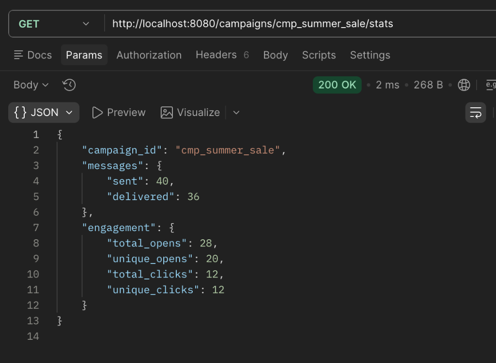
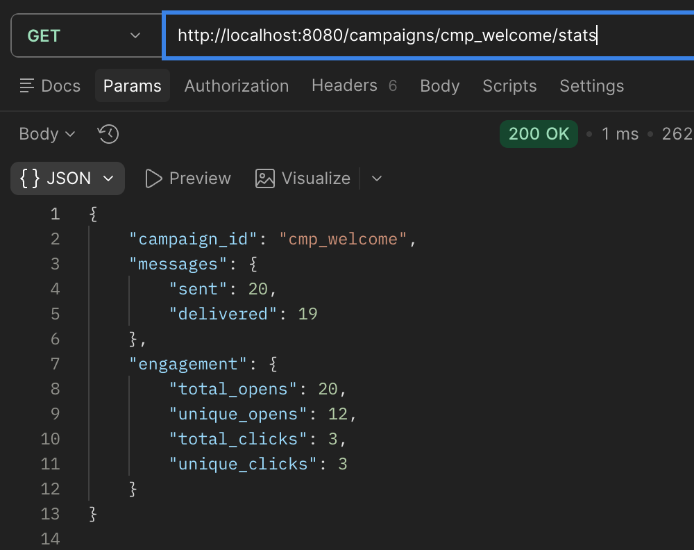
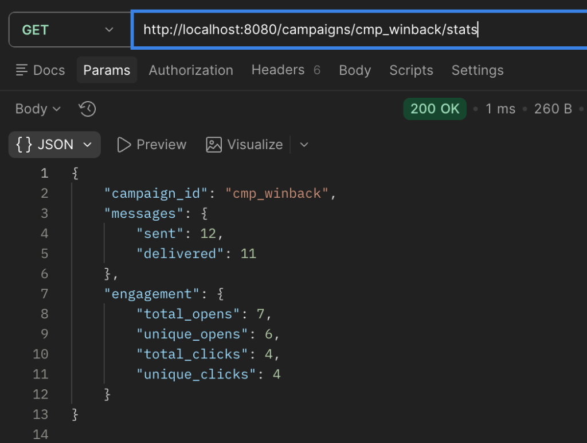
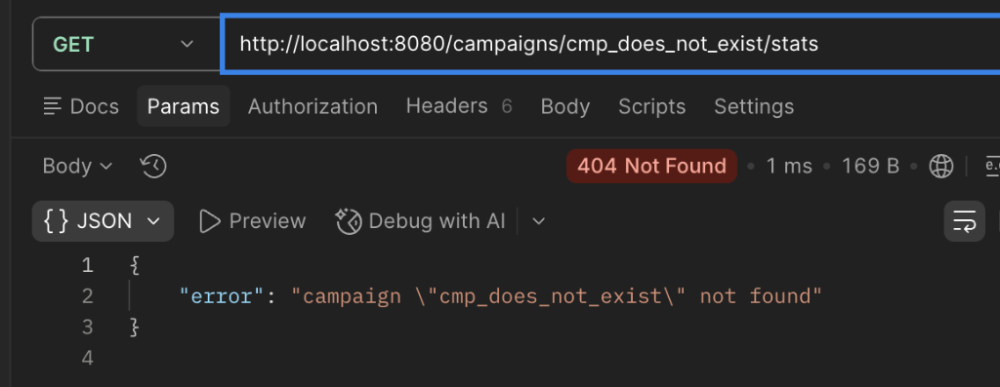
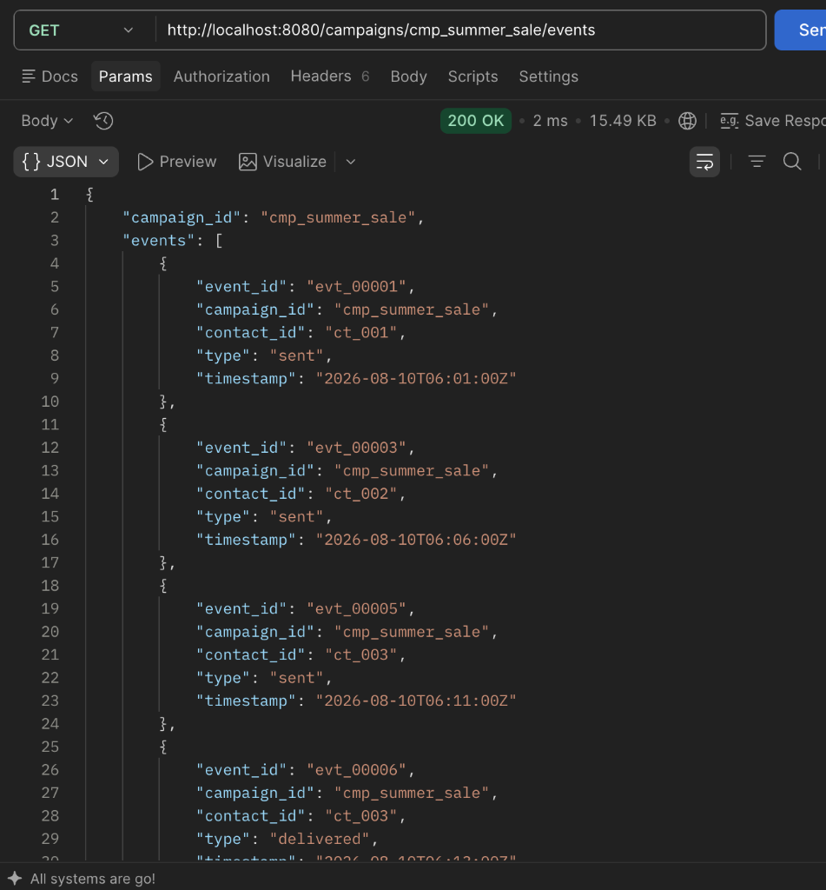

# Campaign Events Service

A high-performance, thread-safe Go HTTP service that ingests marketing events from external delivery providers, deduplicates retries, isolates malformed payloads, and exposes campaign metrics for live dashboards.

---

## 1. Getting Started

### Prerequisites
- **Go 1.22+** (uses standard library routing).
- Zero third-party dependencies required.

### Start the Service
```bash
cd starter
go run .
```
The server starts listening on `:8080`.

### Run Tests
```bash
go test -v -race .
```

---

## 2. Routes & Implementation Details

### 2.1 Server Health Check
* **Route**: `GET /ping`
* **What we did**: Simple liveness probe returning HTTP 200 with a JSON confirmation.
* **Command**:
  ```bash
  curl http://localhost:8080/ping
  ```
* **Output**:
  ```json
  {"message": "pong"}
  ```
* **Screenshot**:
  

---

### 2.2 Ingest Provider Events
* **Route**: `POST /events`
* **What we did**:
  - **Resilient Batch Parsing**: Decodes the body into `[]json.RawMessage` to process items individually. Corrupted records (e.g., invalid timestamps, missing `event_id` or `contact_id`) are rejected without failing the rest of the batch.
  - **Idempotency & Deduplication**: Tracks unique `event_id`s in a concurrency-safe set. Duplicate provider retries are discarded without inflating counters.
  - **Normalization**: Normalizes event types to lowercase (e.g., `OPENED` to `opened`) and parses multi-format timestamps into UTC.
  - **Audit Response**: Returns exact counts of received, accepted, duplicate, and rejected items.
* **Command**:
  ```bash
  curl -i -X POST http://localhost:8080/events \
    -H "Content-Type: application/json" \
    --data-binary @seed/events.json
  ```
* **Output**:
  ```json
  {
    "received": 235,
    "accepted": 212,
    "duplicates": 18,
    "rejected": 5
  }
  ```
* **Screenshot**:
  

---

### 2.3 Campaign Statistics
* **Route**: `GET /campaigns/{campaign_id}/stats`
* **What we did**:
  - Designed the response format to separate **messages** (delivery funnel) from **engagement** (reach).
  - Tracks both gross activity (`total_opens`, `total_clicks`) and unique recipient reach (`unique_opens`, `unique_clicks`) by contact ID.
  - Returns `404 Not Found` if a campaign has no registered events.
* **Commands & Outputs**:

#### Campaign: `cmp_summer_sale`
* **Command**:
  ```bash
  curl http://localhost:8080/campaigns/cmp_summer_sale/stats
  ```
* **Output**:
  ```json
  {
    "campaign_id": "cmp_summer_sale",
    "messages": {
      "sent": 40,
      "delivered": 36
    },
    "engagement": {
      "total_opens": 28,
      "unique_opens": 20,
      "total_clicks": 12,
      "unique_clicks": 12
    }
  }
  ```
* **Screenshot**:
  

#### Campaign: `cmp_welcome`
* **Command**:
  ```bash
  curl http://localhost:8080/campaigns/cmp_welcome/stats
  ```
* **Output**:
  ```json
  {
    "campaign_id": "cmp_welcome",
    "messages": {
      "sent": 20,
      "delivered": 19
    },
    "engagement": {
      "total_opens": 20,
      "unique_opens": 12,
      "total_clicks": 3,
      "unique_clicks": 3
    }
  }
  ```
* **Screenshot**:
  

#### Campaign: `cmp_winback`
* **Command**:
  ```bash
  curl http://localhost:8080/campaigns/cmp_winback/stats
  ```
* **Output**:
  ```json
  {
    "campaign_id": "cmp_winback",
    "messages": {
      "sent": 12,
      "delivered": 11
    },
    "engagement": {
      "total_opens": 7,
      "unique_opens": 6,
      "total_clicks": 4,
      "unique_clicks": 4
    }
  }
  ```
* **Screenshot**:
  

#### Non-Existent Campaign: `cmp_does_not_exist` (404 Not Found)
* **Command**:
  ```bash
  curl -i http://localhost:8080/campaigns/cmp_does_not_exist/stats
  ```
* **Output**:
  ```http
  HTTP/1.1 404 Not Found
  Content-Type: application/json

  {"error":"campaign \"cmp_does_not_exist\" not found"}
  ```
* **Screenshot**:
  

---

### 2.4 Chronological Events (Recent Activity)
* **Route**: `GET /campaigns/{campaign_id}/events`
* **What we did**:
  - Provides an audit trail of all accepted events for a given campaign.
  - Automatically sorts events chronologically based on provider `timestamp`.
* **Command**:
  ```bash
  curl http://localhost:8080/campaigns/cmp_summer_sale/events
  ```
* **Output**:
  ```json
  {
    "campaign_id": "cmp_summer_sale",
    "events": [
      {
        "event_id": "evt_00001",
        "campaign_id": "cmp_summer_sale",
        "contact_id": "ct_001",
        "type": "sent",
        "timestamp": "2026-08-10T06:01:00Z"
      },
      {
        "event_id": "evt_00003",
        "campaign_id": "cmp_summer_sale",
        "contact_id": "ct_002",
        "type": "sent",
        "timestamp": "2026-08-10T06:06:00Z"
      }
    ]
  }
  ```
* **Screenshot**:
  

